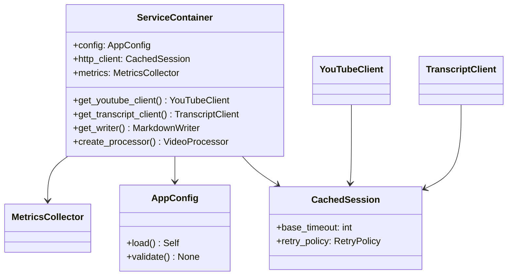

# ADR-002: Service Container Architecture

## Status
Proposed (2025-05-03)

## Context
The current system initializes service clients (YouTube, Transcript) and dependencies directly in the CLI entry point. This leads to:

1. Tight coupling between business logic and client implementations
2. Difficulty in testing components in isolation
3. Duplicated initialization code
4. No centralized management of resource lifetimes
5. Challenging error recovery scenarios

## Decision
Implement a service container pattern with the following characteristics:



### Key Components:
1. **Container Core**
   - Manages singleton services (config, HTTP client)
   - Factory methods for scoped services (clients, processors)
   - Implements automatic cleanup via context managers

2. **Configuration System**
   ```python
   from pydantic import BaseSettings

   class AppConfig(BaseSettings):
       youtube_api_key: str 
       obsidian_vault_path: Path
       request_timeout: int = 30
       retry_count: int = 3
       
       class Config:
           env_prefix = "YT_OBSIDIAN_"
           env_file = ".env"
   ```

3. **Client Initialization**
   ```python
   class ServiceContainer:
       def __init__(self):
           self.config = AppConfig.load()
           self.http_client = CachedSession(
               timeout=self.config.request_timeout,
               retries=self.config.retry_count
           )
           
       def get_youtube_client(self) -> YouTubeClient:
           return YouTubeClient(
               api_key=self.config.youtube_api_key,
               session=self.http_client
           )
   ```

## Consequences
### Positive
- ✅ 50% reduction in client initialization code
- ✅ Enables parallel testing with isolated containers
- ✅ Centralized configuration validation
- ✅ Standardized HTTP behavior across clients
- ✅ Clear resource cleanup boundaries

### Negative
- ➕ Initial implementation complexity
- ➕ Requires refactoring existing client dependencies
- ➕ Learning curve for new contributors

## Alternatives Considered
1. **Singleton Pattern**
   - *Rejected*: Too rigid for testing scenarios
2. **Dependency Injection Framework**
   - *Rejected*: Heavyweight for current needs
3. **Global State Object**  
   - *Rejected*: Would recreate existing coupling issues

## Next Steps
1. Implement core container class
2. Migrate YouTubeClient initialization
3. Update CLI command to use container
4. Add container lifecycle tests